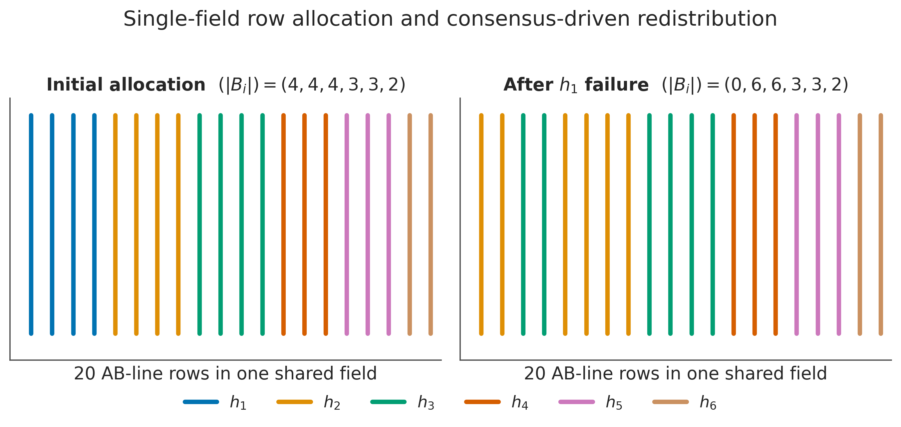
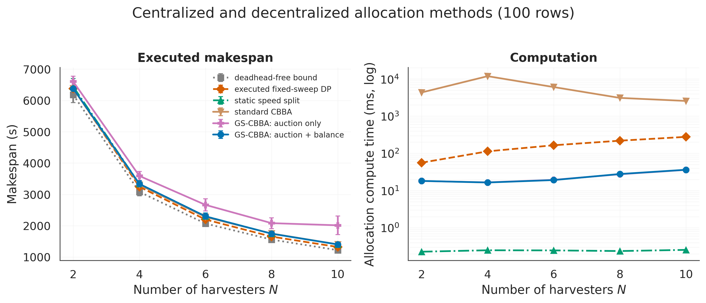
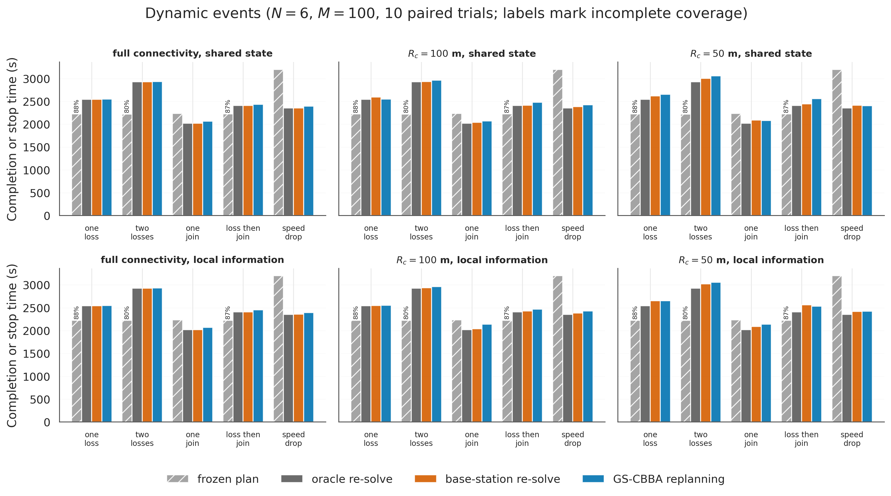
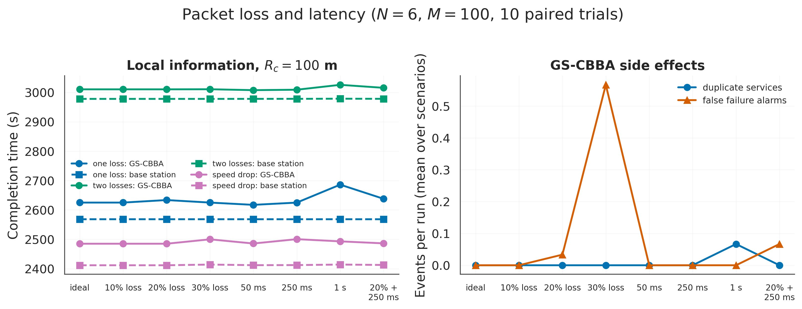
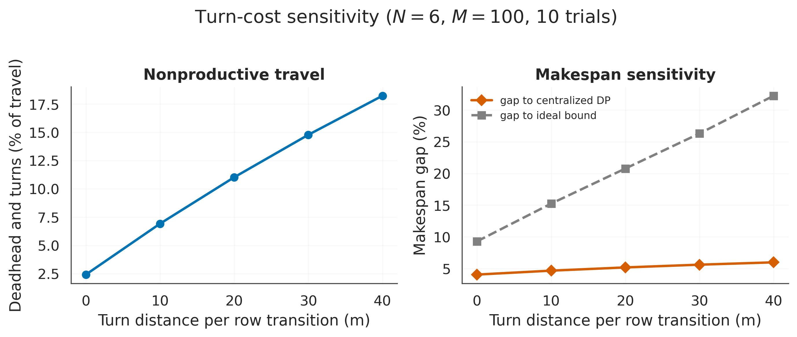

# GS-CBBA

Row allocation and simulation for teams of harvesters.

GS-CBBA assigns field rows through local bidding, uses a KD-tree to find nearby
candidates, and balances connected teams by machine speed. The simulator handles
failures, joining machines, and speed changes. Centralized planners and auction
controls provide comparisons under the same motion model.



Each color identifies a harvester. This 20-row illustration shows one possible
redistribution after a machine fails.

## Get started

Install Nix with flakes enabled, then clone the repository and enter its shell:

```sh
git clone https://github.com/bresilla/gscbba.git
cd gscbba
nix develop
gscbba --help
python -m pytest
```

The shell supplies Python 3.12, NumPy, SciPy, Matplotlib, Seaborn, PuLP, and the
development tools. Dependency versions are pinned by `flake.lock`; there is no
virtual environment to manage.

Run a short experiment:

```sh
gscbba --quick --only scalability
```

Quick runs write to `quick-results/`, leaving the checked-in results untouched.
You can also run the CLI directly through Nix:

```sh
nix run . -- --help
```

## Experiments and plots

```sh
gscbba --only benchmark
gscbba --only events
gscbba --only turncost
gscbba --figures-only
```

`--only` accepts `scalability`, `benchmark`, `commrange`, `events`, `network`,
`turncost`, `loss`, `ksweep`, `ablation`, `timing`, or `diagnostics`.
`--figures-only` rebuilds plots from the JSON files already in `results/`.

To run every experiment and generate all plots:

```sh
gscbba --all
```

Full runs use ten paired seeds for the main experiments and forty for the
heterogeneous-speed benchmark. The exhaustive 1,600-row timing case is
particularly slow. Use `--quick --all` for a shorter pipeline check.

Results go to `results/` and plots to `figures/`, relative to the working
directory. With `--quick` or `--output-dir PATH`, generated plots stay inside
the selected results directory. The JSON files retain individual observations,
summary statistics, and environment metadata.

### Allocation methods



The benchmark uses 100 rows in a 200 m square and ten paired seeds per team size.
Error bars show sample standard deviations. It compares the fixed-sweep DP, a
static speed split, textbook CBBA, GS-CBBA without balancing, and the full
GS-CBBA method. The right panel shows allocation compute time.

### Dynamic events and information



Five event scenarios are run with shared state and with local information, at
full connectivity, 100 m, and 50 m. The comparators are a frozen plan, an oracle
that re-solves with global information, and a base-station coordinator that
reaches only connected machines.

### Packet loss and latency



With local information at 100 m, message loss of up to 30% and per-hop latency
of up to 1 s are applied to GS-CBBA and to the base-station coordinator.

### Turn costs



This six-harvester experiment adds 0–40 m of distance-equivalent cost per row
transition. At 30 m, nonproductive travel reaches 14.8%, compared with 2.4%
without the allowance.

## Python API

```python
import numpy as np

from gscbba.cbba import Simulator, make_harvesters, make_rows, square_field

rng = np.random.default_rng(42)
field = square_field(200.0)
rows = make_rows(field, n_rows=100, heading_deg=90.0)
machines = make_harvesters(6, field, rng, max_bundle=100)

result = Simulator(rows, machines, comm_range=1e9, spatial=True).run()

print(f"Completion time: {result.completion_time:.1f} s")
print(f"Coverage: {result.coverage_fraction:.1%}")
```

`Simulator` accepts `balancing=False` for auction-only allocation. The main
experiments also pass `component_balancing=True`, which lets a connected
subteam rebalance its rows when that shortens its projected finish time, and
`idle_help=True`, which lets an idle machine trigger a replan in its own radio
component. Centralized planners are available in `gscbba.baselines`, and
textbook CBBA (Choi et al., 2009) is available in `gscbba.standard_cbba`:

```python
from gscbba.standard_cbba import standard_cbba

run = standard_cbba(rows, machines, discount=0.9, bundle_limit=25)
print(run.result.makespan, run.iterations, run.converged)
```

By default the simulation uses 0.5 s motion steps, shared completion state,
globally announced failures, and synchronous allocation rounds. Setting
`information="local"` removes the shared state: completed rows spread only by
radio gossip, failures are detected by heartbeat timeouts, and a joining machine
is known only to its neighbors. `packet_loss`, `round_latency`, and
`latency_jitter` add message loss and delay. `allocation_policy="centralized_base"`
replans from a base station that reaches only the machines connected to it.
Vehicle steering dynamics remain outside the model. See
[model details](docs/model.md) for planner constraints, event handling, and
metric definitions.

## Development

The Wing environment loads through `.env.lua` in Oslo. Its task recipes are:

```sh
oslo make verify
oslo make build
oslo make plots
oslo make run --args="--quick --only scalability"
```

The same checks and build tools work directly inside `nix develop`:

```sh
ruff format --check .
ruff check .
python -m pytest
python -m build --no-isolation
```

The wheel and source archive are written to `dist/`.

## License

GS-CBBA is released under the [MIT License](LICENSE).

## Citation

If you use GS-CBBA in your research, please cite the software:

```bibtex
@software{bresilla2026gscbba,
  author = {Bresilla, Trim and Leong, William and Jindo, Keiji and Nieuwenhuizen, Ard},
  title = {{GS-CBBA: Spatially Aware Row Allocation for Multi-Harvester Teams}},
  year = {2026},
  month = {9},
  version = {0.1.0},
  url = {https://github.com/bresilla/gscbba}
}
```

Download [CITATION.bib](CITATION.bib) or use GitHub's "Cite this repository"
button, which reads [CITATION.cff](CITATION.cff).

## Layout

```text
src/gscbba/    Simulator, planners, CLI, and plotting
tests/        Planner, simulator, and command-line tests
results/      Cached experiment observations
figures/      PNG and SVG plots
docs/         Model and metric reference
flake.nix     Nix package and development shell
.make.lua     Oslo task recipes
```
